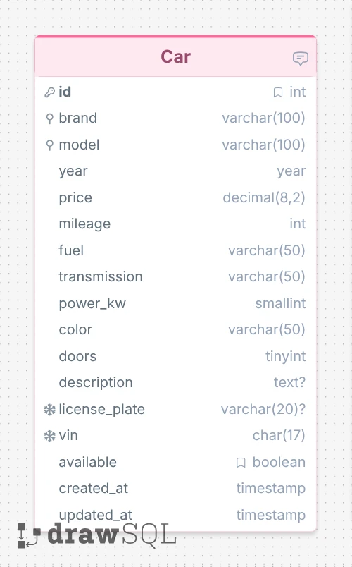

# Database planning

A database planning exercise from my web dev course

## Exercise

- Model the structure of a table to store all data regarding used cars put up for sale by a dealership

## Solution

### Screenshot

### DrawSQL Link

[https://drawsql.app/teams/emanuelefavero/diagrams/db-first](https://drawsql.app/teams/emanuelefavero/diagrams/db-first)

### DB file

[db/Car.sql](db/Car.sql)

## Car Schema

- id: int PK auto unsigned
- brand: varchar(100) indexed
- model: varchar(100) indexed
- year: year
- price: decimal
- mileage: int unsigned
- fuel: varchar(50)
- transmission: varchar(50)
- power_kw: smallint unsigned
- color: varchar(50)
- doors: tinyint unsigned
- description: text nullable
- license_plate: varchar(20) unique nullable
- vin: char(17) unique
- available: boolean default:true
- created_at: timestamp
- updated_at: timestamp

> Note: Columns are NOT NULL unless marked `nullable`
